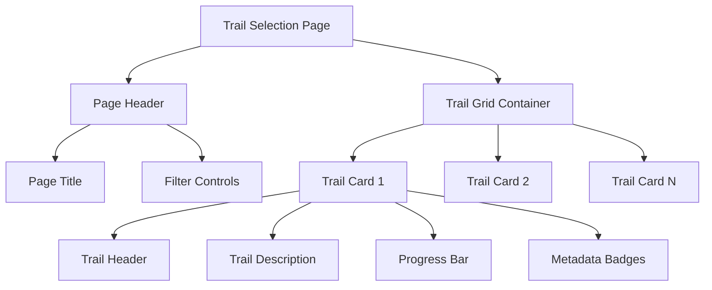
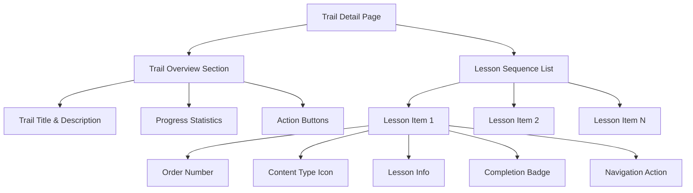
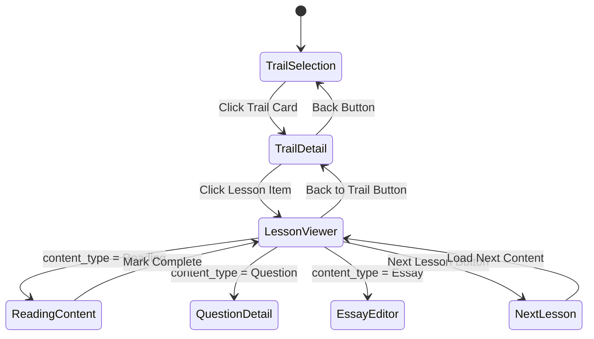
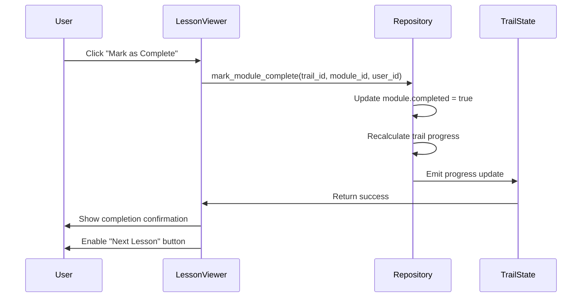

# Knowledge Trails and Lessons Interface Design

## Overview

This design specifies a two-phase user interface for the knowledge trails system: a trail selection view displaying all available trails, and a detailed lesson view showing the ordered sequence of lessons within a selected trail. The interface enables users to browse available learning paths and navigate through structured educational content.

## Objectives

1. Provide an intuitive grid-based trail selection interface
2. Enable users to view detailed lesson sequences for each trail
3. Display progress tracking and completion status
4. Maintain the application's cyberpunk aesthetic
5. Support navigation between trail list and trail detail views

## System Behavior

### Trail Selection View

The system displays all available knowledge trails in a responsive grid layout. Each trail is presented as an interactive card showing:

- Trail title and description
- Subject focus areas with visual indicators
- Overall progress percentage
- Difficulty level badge
- Estimated completion time
- Visual completion indicator

When a user clicks on a trail card, the system transitions to the Trail Detail View for that specific trail.

### Trail Detail View

The system displays the complete structure of a single trail, organized sequentially by lesson order. The view includes:

- Trail header with metadata (title, description, progress, difficulty)
- Sequential list of all modules/lessons in order
- Visual indicators for each lesson showing:
  - Lesson number in sequence
  - Lesson title and description
  - Content type icon (Reading, Video, Question, Essay, Practice Test)
  - Completion status
  - Interactive navigation to lesson content

Users can navigate back to the trail selection view or proceed to individual lesson content.

### Lesson Click Interaction

When a user clicks on a lesson item in the trail detail view:

1. **Route Construction**: System constructs route URL with trail_id and module_id parameters
2. **Navigation**: Browser navigates to /trilha/:trail_id/licao/:module_id
3. **Data Fetch**: Lesson viewer fetches module data and determines content_type
4. **Content Routing**: Based on content_type, system routes to appropriate viewer:
   - **Reading**: Fetches reading content by content_id and displays in ReadingContentViewer
   - **Question**: Redirects to /questao/:content_id using existing question detail page
   - **Essay**: Redirects to /redacao/nova with trail context
   - **Video**: Displays video player with content_id (future implementation)
   - **PracticeTest**: Displays practice test interface (future implementation)
5. **Content Display**: Appropriate content viewer renders the lesson material
6. **Completion Tracking**: User can mark lesson as complete via action button

### Reading Lesson Display

For Reading type lessons, the system:

1. **Fetches Content**: Retrieves reading content entity by content_id
2. **Renders Text**: Displays formatted content in comfortable reading layout
3. **Tracks Progress**: Monitors scroll position and time spent
4. **Enables Completion**: Provides "Mark as Complete" button
5. **Calculates Navigation**: Determines next and previous lessons in sequence
6. **Updates State**: On completion, updates module status and trail progress

### Completion and Progress Flow

When a user marks a lesson as complete:

1. **Status Update**: Module's completed field set to true
2. **Progress Recalculation**: Trail progress percentage recalculated
3. **UI Refresh**: Completion checkmark displayed
4. **Next Lesson Enabled**: Navigation to next lesson becomes available
5. **Trail Detail Sync**: Trail detail view shows updated completion status
6. **Persistence**: Changes saved to repository

## Data Model

### Knowledge Trail Structure

| Field | Type | Description |
|-------|------|-------------|
| id | UUID | Unique trail identifier |
| title | String | Trail display name |
| description | String | Detailed trail overview |
| focus_areas | Array of Subject | Main subjects covered |
| progress | Integer (0-100) | User completion percentage |
| modules | Array of TrailModule | Ordered lesson collection |
| estimated_hours | Integer | Expected completion time |
| difficulty_level | Difficulty Enum | Easy, Medium, or Hard |

### Trail Module Structure

| Field | Type | Description |
|-------|------|-------------|
| id | UUID | Unique module identifier |
| title | String | Module display name |
| description | String | Module overview |
| content_type | ContentType Enum | Reading, Video, Question, Essay, PracticeTest |
| content_id | UUID | Reference to actual content |
| order | Integer | Sequential position in trail |
| completed | Boolean | User completion status |

### Reading Content Model

For lessons with content_type = Reading, the content_id references a reading content entity:

| Field | Type | Description |
|-------|------|-------------|
| id | UUID | Unique identifier matching content_id |
| title | String | Reading lesson title |
| content | String | Full text content (markdown or rich text) |
| estimated_reading_time | Integer | Estimated minutes to read |
| subject | Subject Enum | Related subject area |
| difficulty | Difficulty Enum | Content difficulty level |
| author | Optional String | Content author or source attribution |
| references | Array of String | External references, citations, or links |
| created_at | DateTime | Creation timestamp |
| updated_at | DateTime | Last modification timestamp |

The reading content is stored separately from trail modules to enable:
- Content reuse across multiple trails
- Independent content management and updates
- Versioning of educational materials
- Content sharing and recommendations

## Interface Structure

### Trail Selection Page

The page is organized with the following hierarchy:



Each Trail Card contains:
- **Header Section**: Title and current progress percentage
- **Description Section**: Brief overview text
- **Metadata Section**: Subject tags, difficulty badge, estimated hours
- **Progress Indicator**: Visual bar showing completion percentage
- **Interactive Area**: Click to navigate to trail detail

### Trail Detail Page

The page displays a single trail's complete lesson structure:



Each Lesson Item displays:
- **Order Indicator**: Sequential number (1, 2, 3...)
- **Content Type Icon**: Visual representation of lesson type
- **Lesson Information**: Title and description
- **Completion Status**: Checkmark or progress indicator
- **Action Button**: Navigate to lesson content

## Navigation Flow



The navigation system supports:

1. **Trail Selection to Trail Detail**: User clicks on any trail card
2. **Trail Detail to Trail Selection**: Back navigation button or breadcrumb
3. **Trail Detail to Lesson Viewer**: User clicks on lesson item
4. **Lesson Viewer Content Routing**: Routes to appropriate viewer based on content_type
5. **Lesson Viewer to Trail Detail**: Back navigation after viewing/completion
6. **Sequential Lesson Navigation**: Next/Previous buttons within lesson viewer
7. **Lesson Completion**: Mark as complete and proceed to next lesson

## Routing Configuration

The application routing must support:

| Route Pattern | Component | Purpose |
|--------------|-----------|---------|
| /trilhas | TrailSelectionPage | Display all available trails |
| /trilha/:trail_id | TrailDetailPage | Display single trail with lessons |
| /trilha/:trail_id/licao/:module_id | LessonViewerPage | Display lesson content based on content type |

Navigation parameters:
- **trail_id**: UUID identifying the selected trail
- **module_id**: UUID identifying the specific lesson module

The lesson viewer page routes to specific content based on the module's content_type:
- **Reading**: Display text content in a readable format
- **Question**: Navigate to existing question detail page
- **Essay**: Navigate to essay writing page
- **Video**: Display video player with content
- **PracticeTest**: Display test interface with multiple questions

## Repository Interface

### Trail Repository Methods

The repository layer must provide the following operations:

**list_available()**
- Returns all available knowledge trails
- Used by the trail selection view
- Includes basic metadata for card display

**find_by_id(trail_id)**
- Returns complete trail data including all modules
- Used by the trail detail view
- Includes ordered module list

**update_progress(trail_id, user_id, progress)**
- Updates user progress for a specific trail
- Triggered when lessons are completed
- Recalculates overall trail progress

### Module Completion Tracking

**mark_module_complete(trail_id, module_id, user_id)**
- Marks a specific lesson as completed
- Updates module completion status
- Triggers trail progress recalculation

### Reading Content Repository

The system requires a new repository for managing reading lesson content:

**Reading Content Data Model**

| Field | Type | Description |
|-------|------|-------------|
| id | UUID | Unique content identifier (matches content_id in TrailModule) |
| title | String | Reading lesson title |
| content | String | Full text content in markdown or HTML format |
| estimated_reading_time | Integer | Estimated minutes to complete |
| author | Optional String | Content author or source |
| references | Array of String | External references or citations |

**find_reading_by_id(content_id)**
- Returns reading content by its UUID
- Used by the lesson viewer when content_type is Reading
- Returns formatted text content ready for display

**list_readings()**
- Returns all available reading materials
- Used for content management and seeding

## UI Component Breakdown

### TrailSelectionPage Component

**Responsibilities**:
- Fetch all available trails from repository
- Render responsive grid of trail cards
- Handle trail card click events
- Navigate to trail detail view

**Data Requirements**:
- List of all trails with metadata
- User progress data for each trail

**User Interactions**:
- Click trail card → Navigate to trail detail
- Filter/sort trails (optional enhancement)

### TrailDetailPage Component

**Responsibilities**:
- Fetch single trail with complete module list
- Display trail overview information
- Render ordered list of lesson items
- Handle lesson navigation
- Provide back navigation to trail selection

**Data Requirements**:
- Complete trail data including modules
- User completion status for each module
- Trail progress statistics

**User Interactions**:
- Click back button → Return to trail selection
- Click lesson item → Navigate to lesson content
- View progress statistics

### LessonViewerPage Component

**Responsibilities**:
- Receive trail_id and module_id from route parameters
- Fetch module details from trail data
- Route to appropriate content viewer based on content_type
- Display content in appropriate format
- Track lesson completion
- Provide navigation to next/previous lessons
- Enable return to trail detail view

**Data Requirements**:
- Current module information
- Content data based on content_type and content_id
- Trail context for navigation
- Completion status

**User Interactions**:
- Read content and scroll through lesson
- Click "Mark as Complete" button
- Navigate to next lesson in sequence
- Navigate to previous lesson
- Return to trail detail view

**Content Type Routing**:
- **Reading**: Display ReadingContentViewer component
- **Question**: Navigate to /questao/:content_id route
- **Essay**: Navigate to /redacao/nova with context
- **Video**: Display VideoPlayer component
- **PracticeTest**: Display PracticeTestViewer component

### ReadingContentViewer Component

**Responsibilities**:
- Display formatted text content
- Provide comfortable reading experience
- Show estimated reading time
- Enable text size adjustments
- Track reading progress

**Props**:
- content_id: UUID
- module: TrailModule object
- on_complete: Callback function

**Data Requirements**:
- Reading content retrieved by content_id
- Current reading position (scroll tracking)

**User Interactions**:
- Scroll through content
- Adjust text size (optional)
- Click "Mark as Complete" button
- Navigate using lesson controls

### TrailCard Component

**Responsibilities**:
- Display trail summary information
- Render progress visualization
- Provide clickable interaction area

**Props**:
- trail_id: UUID
- title: String
- description: String
- progress: Integer (0-100)
- focus_areas: Array of Subject
- difficulty_level: Difficulty
- estimated_hours: Integer

### LessonItem Component

**Responsibilities**:
- Display lesson information in sequence
- Show content type with visual icon
- Indicate completion status
- Provide navigation action

**Props**:
- module_id: UUID
- order: Integer
- title: String
- description: String
- content_type: ContentType
- completed: Boolean
- on_click: Event handler

## Visual Design Guidelines

### Trail Selection View

**Layout**:
- Responsive grid: 1 column (mobile), 2 columns (tablet), 3 columns (desktop)
- Consistent card spacing and alignment
- Maximum content width for readability

**Trail Card Styling**:
- Use CyberCard component for consistent cyberpunk aesthetic
- Neon accent colors for borders and highlights
- Smooth hover effects with glow intensification
- Progress bars with gradient fills

**Visual Hierarchy**:
- Prominent trail title
- Secondary emphasis on progress percentage
- Tertiary information for metadata badges

### Trail Detail View

**Layout**:
- Fixed header with trail overview
- Scrollable lesson list below header
- Sticky back navigation button

**Lesson List Styling**:
- Alternating subtle background for readability
- Clear visual separation between lessons
- Sequential numbering with prominent typography
- Icon system for content types (book, video, question mark, essay, test)

**Completion Indicators**:
- Completed lessons: Green checkmark with reduced opacity
- Active lesson: Highlighted with neon accent
- Locked lessons (if sequential): Grayed out with lock icon

### Lesson Viewer Page

**Layout**:
- Full-width content area for immersive reading
- Top navigation bar with breadcrumb and controls
- Content section with optimal reading width (max 800px centered)
- Bottom navigation bar with lesson controls
- Fixed or sticky header for easy navigation

**Reading Content Styling**:
- Dark background (#0a0a0f or similar) consistent with app theme
- Primary text color: Light gray (#e0e0e0) for body text
- Headings: Neon-accented colors (cyan, purple) for hierarchy
- Font: Clean, readable sans-serif (system font stack)
- Base font size: 18px for comfortable reading
- Line height: 1.7 for optimal readability
- Paragraph spacing: 1.5em between paragraphs

**Content Container**:
- Maximum width: 800px for optimal line length
- Horizontal padding: 2rem on desktop, 1rem on mobile
- Vertical padding: 3rem for breathing room
- Smooth scrolling behavior

**Navigation Controls Styling**:
- Fixed bottom bar with glass morphism effect
- Buttons use NeonButton component for consistency
- "Mark as Complete" button: Primary neon green accent
- "Next Lesson" button: Secondary neon blue accent
- "Back to Trail" button: Tertiary gray accent
- Icon + text labels for clarity

**Progress Indicators**:
- Reading progress bar at top of page (subtle, 2-3px height)
- Completion checkmark icon in top navigation when complete
- Time spent indicator in navigation bar

## Content Type Icon Mapping

Visual representation for each lesson type:

| Content Type | Icon Representation | Color Accent |
|--------------|---------------------|--------------|
| Reading | Book/Document icon | Blue neon |
| Video | Play button icon | Purple neon |
| Question | Question mark icon | Green neon |
| Essay | Pen/Writing icon | Orange neon |
| PracticeTest | Test/Checklist icon | Red neon |

## Progress Calculation

### Module-Level Progress

Individual module completion is binary:
- completed = true: 100% complete
- completed = false: 0% complete

### Trail-Level Progress

Trail progress is calculated as:
```
progress = (completed_modules / total_modules) * 100
```

The system automatically recalculates trail progress when any module completion status changes.

## State Management

### Trail Selection State

The component maintains:
- **trails**: Array of trail summaries
- **loading**: Boolean for async data fetch
- **error**: Optional error message

### Trail Detail State

The component maintains:
- **trail**: Complete trail data with modules
- **loading**: Boolean for async data fetch
- **error**: Optional error message
- **selected_lesson**: Currently highlighted lesson (optional)

### Lesson Viewer State

The component maintains:
- **module**: Current lesson module data
- **content**: Actual lesson content (reading text, video URL, etc.)
- **loading**: Boolean for async content fetch
- **error**: Optional error message
- **completed**: Boolean indicating if user marked as complete
- **scroll_progress**: Percentage of content scrolled (0-100)
- **next_module**: Next lesson in sequence (optional)
- **previous_module**: Previous lesson in sequence (optional)

### Reading Content Viewer State

The component maintains:
- **reading_content**: Full text content
- **text_size**: User-preferred font size setting
- **scroll_position**: Current scroll position for progress tracking
- **time_spent**: Elapsed time on current lesson

## Error Handling

### Trail Not Found

When a requested trail_id does not exist:
- Display user-friendly error message
- Provide navigation back to trail selection
- Log error for debugging

### Failed Data Load

When repository operations fail:
- Display retry option
- Show cached data if available
- Provide fallback navigation

### Empty State

When no trails are available:
- Display informative empty state message
- Suggest next actions (e.g., check back later)

## Accessibility Considerations

- **Keyboard Navigation**: Full support for tab navigation and enter key activation
- **Screen Reader Support**: Semantic HTML with appropriate ARIA labels
- **Focus Indicators**: Clear visual focus states for interactive elements
- **Progress Announcements**: Announce completion status changes to assistive technologies

## Performance Considerations

### Data Loading Strategy

- Load trail summaries immediately for selection view
- Defer detailed module data until trail detail view
- Cache trail data to avoid redundant fetches

### Rendering Optimization

- Virtualize long lesson lists if trails contain 50+ modules
- Lazy load trail detail data on navigation
- Optimize image and icon assets

## Lesson Content Display

### Reading Content Format

Reading lessons display formatted text with:

**Content Structure**:
- Prominent lesson title
- Estimated reading time indicator
- Formatted body text with proper typography
- Section headings and subheadings
- Support for embedded images (future)
- References and citations at bottom

**Text Formatting**:
- Support for markdown or HTML content
- Proper paragraph spacing
- Code blocks with syntax highlighting (if applicable)
- Blockquotes for emphasis
- Bullet and numbered lists
- Bold and italic text formatting

**Reading Experience**:
- Optimal line length (60-80 characters)
- Comfortable font size (16-18px base)
- High contrast text for readability
- Adequate line height (1.6-1.8)
- Dark theme with neon accents consistent with app design

### Lesson Navigation Controls

At the bottom of each lesson, display:

**Progress Section**:
- Completion checkbox or button
- Visual indicator if already completed
- Estimated time vs actual time spent

**Navigation Buttons**:
- "Previous Lesson" button (disabled if first lesson)
- "Back to Trail" button (returns to trail detail)
- "Next Lesson" button (enabled after completion)
- "Mark as Complete" button (primary action)

**Navigation Flow**:
1. User reads content
2. User clicks "Mark as Complete"
3. System updates completion status
4. System recalculates trail progress
5. "Next Lesson" button becomes enabled
6. User can proceed to next lesson or return to trail

### Content Loading Behavior

When loading lesson content:

**Loading States**:
- Display skeleton loader while fetching content
- Show loading spinner for content retrieval
- Preserve scroll position on navigation back

**Error States**:
- Display user-friendly error if content not found
- Provide retry button
- Enable navigation back to trail detail

**Success State**:
- Smooth fade-in of content
- Auto-scroll to top of content
- Focus on reading area for accessibility

## Internationalization

All user-facing text must support translation:

**Trail Selection View**:
- Page title
- Empty state message
- Filter/sort labels
- Difficulty level labels

**Trail Detail View**:
- Back navigation label
- Progress statistics labels
- Completion status text
- Content type labels

**Lesson Viewer**:
- "Mark as Complete" button text
- "Next Lesson" / "Previous Lesson" button text
- "Back to Trail" button text
- "Estimated reading time" label
- "Time spent" label
- Completion confirmation message

Translation keys should follow the pattern:
- `trails.page-title`
- `trails.difficulty-{level}`
- `trails.content-type-{type}`
- `trails.progress-label`
- `trails.lesson-complete`
- `trails.next-lesson`
- `trails.previous-lesson`
- `trails.back-to-trail`
- `trails.reading-time`
- `trails.mark-complete`

## Future Enhancements

### Phase 2 Enhancements

- **Trail Filtering**: Filter by subject, difficulty, or completion status
- **Trail Search**: Search trails by title or description
- **Recommended Trails**: Personalized recommendations based on user progress
- **Trail Bookmarking**: Save favorite trails for quick access

### Phase 3 Enhancements

- **Sequential Unlocking**: Lock lessons until prerequisites are completed
- **Trail Analytics**: Detailed statistics on time spent and performance
- **Social Features**: Share progress or compare with peers
- **Custom Trails**: Allow users to create personalized learning paths

## Lesson Completion Logic

### Completion Workflow

When a user marks a lesson as complete:



### Progress Recalculation

After marking a module complete:
1. Count total modules in trail
2. Count completed modules
3. Calculate percentage: (completed / total) × 100
4. Update trail progress field
5. Persist updated trail state
6. Update UI to reflect new progress

### Sequential vs Free Navigation

**MVP Approach (Free Navigation)**:
- All lessons are accessible regardless of completion status
- Users can complete lessons in any order
- Progress tracks overall completion percentage

**Future Enhancement (Sequential Navigation)**:
- Lock lessons until prerequisites are completed
- Force sequential progression through trail
- Display lock icon for unavailable lessons
- Show dependency requirements

## Implementation Priority

### High Priority (MVP)

1. Trail selection view with grid layout
2. Trail detail view with ordered lessons
3. Lesson viewer page with routing
4. Reading content viewer component
5. Reading content repository and data model
6. Lesson click navigation from trail detail
7. "Mark as Complete" functionality
8. Progress tracking and display
9. Content type icons and indicators
10. Next/Previous lesson navigation

### Medium Priority

1. Responsive design for mobile/tablet
2. Loading states and error handling
3. Completion status persistence
4. Back navigation and breadcrumbs
5. Reading time estimation and tracking
6. Text size adjustment controls
7. Scroll progress tracking

### Low Priority

1. Filter and search functionality
2. Advanced progress analytics
3. Trail recommendations
4. Performance optimizations (virtualization)
5. Sequential lesson locking
6. Video and practice test viewers
7. Embedded content support