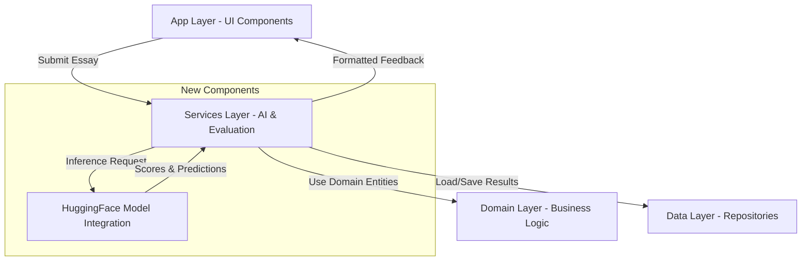
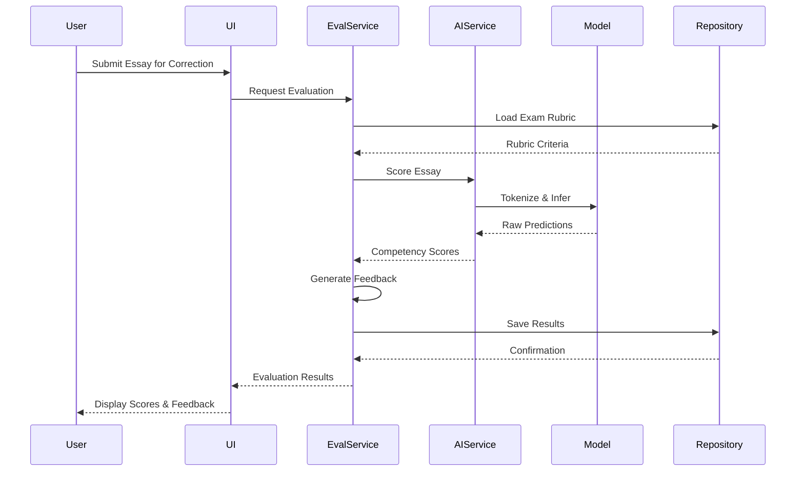

# Essay AI Correction Feature Design

## Overview

This design document outlines the implementation of an AI-powered essay correction system for the NeuroNexus platform. The system will automatically evaluate student essays according to the specific grading criteria of Brazilian standardized exams, with initial focus on ENEM (Exame Nacional do Ensino Médio). The solution leverages a Hugging Face transformer model optimized for Brazilian Portuguese to provide automated scoring, detailed feedback, and suggestions for improvement.

## Strategic Goals

- Provide instant, consistent, and scalable essay evaluation to students
- Eliminate human grader availability constraints and reduce evaluation turnaround time
- Ensure scoring aligns with official exam provider rubrics and criteria
- Deliver actionable feedback that helps students improve their writing skills
- Support mobile and web platforms with efficient processing
- Maintain commercial viability with appropriate licensing
- **Enable 100% offline operation after initial model download for complete independence from internet connectivity**

## System Context

### Current State

The platform currently supports:
- Essay creation and storage with exam type association
- Data models for essays, corrections, and rubric scores
- UI for viewing essay details and scores
- Multiple Brazilian exam types with different scoring systems

### Gaps

- No automated evaluation capability (ai.rs and evaluation.rs are placeholder files)
- Missing AI model integration infrastructure
- No scoring logic implementation
- Absence of feedback generation system
- No criterion-specific evaluation

## Exam Scoring Requirements

### ENEM Grading System

ENEM essays are evaluated across five competencies, each scored from 0 to 200 points in 40-point increments (0, 40, 80, 120, 160, 200), totaling a maximum of 1000 points.

| Competency | Description | Evaluation Focus |
|------------|-------------|------------------|
| C1: Written Norm Mastery | Adherence to formal written Portuguese standards | Grammar, orthography, syntax, punctuation, accentuation |
| C2: Genre and Theme Compliance | Conforming to argumentative-dissertative text genre and addressing the proposed theme | Text structure, theme relevance, use of multidisciplinary knowledge |
| C3: Argument Organization | Selecting, relating, organizing, and interpreting information to defend a viewpoint | Logical coherence, evidence quality, argument strength, critical thinking |
| C4: Linguistic Mechanisms | Using cohesive devices and argumentative linguistic structures | Textual cohesion, connectors, discourse markers, paragraph transitions |
| C5: Solution Proposal | Elaborating intervention proposals respecting human rights | Proposal feasibility, detail level, social agents specification, intervention means |

### Scoring Levels Per Competency

Each competency uses standardized scoring thresholds:

| Score | Performance Level |
|-------|------------------|
| 0 | Complete absence of the required competency or text disqualification |
| 40 | Very weak demonstration of the competency |
| 80 | Weak demonstration with significant deficiencies |
| 120 | Reasonable demonstration with some deficiencies |
| 160 | Good demonstration with minor deficiencies |
| 200 | Excellent demonstration of the competency |

### Other Exam Types

While ENEM is the primary focus, the system must accommodate other exam providers with varying criteria:

- **FUVEST**: Maximum 48 points with different rubric structure
- **UNICAMP**: Maximum 60 points, emphasis on creativity and originality
- **UNESP**: Maximum 40 points, structured evaluation
- Other university-specific exams with their respective criteria

The system design must remain flexible to support future rubric definitions for each exam type.

## AI Model Selection

### Requirements

- **Language Support**: Native Brazilian Portuguese language understanding
- **Model Size**: Efficient enough for mobile deployment (under 1GB)
- **License**: Commercial-friendly license permitting production use
- **Performance**: State-of-the-art results on Portuguese NLP tasks
- **Task Suitability**: Regression or classification capabilities for scoring
- **Offline Capability**: Fully functional without internet after initial model download

### Recommended Model: BERTimbau Base

**Model Identifier**: neuralmind/bert-base-portuguese-cased

**Rationale**:
- Pre-trained specifically on Brazilian Portuguese corpus (BrWaC)
- Proven effectiveness in essay scoring research with ENEM datasets
- 110 million parameters (mobile-friendly compared to Large variant's 335M)
- Apache 2.0 License (commercial use permitted)
- State-of-the-art performance on Portuguese NLP benchmarks
- Extensive fine-tuning literature for essay scoring tasks
- **Self-contained model requiring no external API calls or internet connectivity for inference**

**Technical Specifications**:
- Architecture: BERT-Base with 12 transformer layers
- Hidden Size: 768 dimensions
- Vocabulary: Brazilian Portuguese specific tokenizer
- Context Window: 512 tokens
- Training Corpus: BrWaC (Brazilian Web as Corpus)

### Alternative Considerations

If BERTimbau proves insufficient, fallback options include:
- **Albertina PT-BR 900M**: Larger model with 900M parameters, better performance but heavier
- **Portuguese RoBERTa models**: Alternative transformer architectures
- Custom distilled models: Smaller models derived from larger Portuguese LLMs

## System Architecture

### Component Overview

The AI correction system integrates into the existing clean architecture through three primary layers:

### Service Layer Design

The Services crate will host the AI correction logic through two primary modules:

#### AI Service Module

**Purpose**: Manage model lifecycle, inference, and predictions

**Responsibilities**:
- Model initialization and loading from local storage (downloaded once from Hugging Face)
- Tokenization of essay text with theme context using local tokenizer
- Inference execution for competency scoring entirely on-device
- Output interpretation and score extraction
- Model caching and resource management
- **All operations must function without network connectivity**

**Key Operations**:
- Load pre-trained BERTimbau model
- Fine-tune or load fine-tuned weights for essay scoring
- Process essay text through tokenizer
- Execute forward pass through model
- Map model outputs to competency scores

#### Evaluation Service Module

**Purpose**: Orchestrate evaluation workflow and generate structured feedback

**Responsibilities**:
- Coordinate AI model inference
- Apply exam-specific rubric rules
- Generate criterion-specific feedback
- Identify text corrections and suggestions
- Calculate total scores and performance metrics
- Format evaluation results for storage and display

**Key Operations**:
- Retrieve exam-specific rubric definitions
- Invoke AI service for score prediction
- Generate detailed feedback per competency
- Identify specific text issues with position markers
- Create correction suggestions
- Aggregate results into domain entities

### Data Flow

### Model Integration Strategy

**Offline-First Design Principle**: All model operations execute locally without requiring network access after initial setup.

**Inference Approach**:
1. **Input Formatting**: Concatenate essay theme and content with special separator token
2. **Tokenization**: Apply BERTimbau tokenizer with proper padding and truncation (using local vocabulary)
3. **Model Forward Pass**: Execute inference through BERT layers on-device
4. **Output Extraction**: Extract hidden states or classification heads
5. **Score Mapping**: Map model outputs to discrete competency scores using local rules

**Model Architecture Extension**:
The base BERTimbau model requires a regression head for score prediction:
- Input: BERT hidden states (768 dimensions)
- Dropout layer (0.3 rate) for regularization
- Linear projection layer outputting 5 values (one per competency)
- Activation or rounding to map to valid score ranges

### Storage and State Management

**Model Artifacts**:
- Pre-trained weights stored in application data directory or bundled with app
- Fine-tuned model checkpoint management with local versioning
- Model update strategy through app updates or optional manual downloads
- Lazy loading to optimize startup time
- **All artifacts stored locally for offline access**
- Tokenizer vocabulary and configuration files bundled with model
- Rubric definitions and feedback templates stored locally

**Evaluation Results**:
Leverage existing domain entities:
- `Essay.score`: Total score (sum of competencies)
- `Essay.rubric_scores`: HashMap of criterion scores
- `Essay.corrections`: List of text-level corrections
- `Essay.feedback`: Overall textual feedback
- `Essay.status`: Update to "Corrigida" upon completion

## Functional Requirements

### Essay Evaluation Workflow

**Input**: Essay entity with content, theme, and exam type

**Processing Steps**:
1. Validate essay content is not empty and meets minimum requirements
2. Retrieve exam-specific rubric from configuration or database
3. Prepare input text with theme separator
4. Execute AI model inference
5. Interpret predictions into discrete competency scores
6. Generate competency-specific feedback text
7. Identify common errors and generate corrections
8. Calculate total score
9. Update essay entity with results
10. Persist changes to database

**Output**: Updated Essay entity with scores, feedback, and corrections

### Competency-Specific Feedback Generation

For each competency, generate structured feedback addressing:

**C1 - Written Norm Feedback**:
- Identify grammatical errors (subject-verb agreement, verb conjugation)
- Highlight orthographic issues (spelling, accentuation)
- Flag punctuation problems
- Note syntax irregularities

**C2 - Genre and Theme Feedback**:
- Assess adherence to argumentative-dissertative structure
- Evaluate theme relevance and coverage
- Check for introduction, development, and conclusion sections
- Verify use of external knowledge and references

**C3 - Argument Organization Feedback**:
- Evaluate logical flow and coherence
- Assess evidence quality and relevance
- Check argument strength and persuasiveness
- Note critical thinking demonstration

**C4 - Linguistic Mechanisms Feedback**:
- Identify cohesion issues between sentences and paragraphs
- Evaluate use of connectors and discourse markers
- Assess text unity and progression
- Note repetition or lack of variety in linguistic resources

**C5 - Solution Proposal Feedback**:
- Evaluate proposal clarity and feasibility
- Check for detailed action specification
- Verify identification of social agents and intervention means
- Ensure human rights respect and social responsibility

### Correction Suggestions

Generate specific corrections with:
- **Position**: Character or line position in original text
- **Original Text**: Problematic text segment
- **Suggested Text**: Recommended replacement
- **Reason**: Explanation of the issue
- **Rubric Criterion**: Associated competency

### User Interaction Points

**Triggering Evaluation**:
- Manual trigger button in essay detail view
- Automatic evaluation option upon essay submission
- Batch evaluation capability for multiple essays

**Viewing Results**:
- Overall score display prominently
- Per-competency score breakdown with visual indicators
- Expandable feedback sections for each criterion
- Inline corrections highlighted in essay text
- Comparison with score distribution or benchmarks

## Non-Functional Requirements

### Performance

- **Inference Time**: Single essay evaluation under 5 seconds on web platform
- **Mobile Performance**: Evaluation under 10 seconds on mobile devices
- **Concurrent Processing**: Support 10+ simultaneous evaluations
- **Model Loading**: Initial model load under 3 seconds
- **Response Time**: UI updates within 500ms of receiving results

### Scalability

- **Stateless Design**: Evaluation service must be stateless for horizontal scaling
- **Model Caching**: Share loaded model across requests to minimize memory
- **Batch Processing**: Support batch evaluation for efficiency
- **Resource Limits**: Set maximum concurrent inference requests per instance

### Accuracy and Quality

- **Target Accuracy**: 70%+ exact match with human graders on ENEM competency scores
- **Acceptable Variance**: Within ±1 scoring level (±40 points) on 90% of evaluations
- **Consistency**: Same essay evaluated multiple times yields identical results
- **Fairness**: No bias based on essay topic, student background, or writing style

### Reliability

- **Error Handling**: Graceful degradation when model unavailable
- **Fallback Strategy**: Queue for retry or manual grading when AI fails
- **Timeout Protection**: Evaluation timeout after 30 seconds
- **Validation**: Input validation prevents malformed requests

### Security and Privacy

- **Data Protection**: Essay content encrypted in transit and at rest
- **Model Security**: Prevent model extraction or reverse engineering
- **Access Control**: Only authorized users access evaluation results
- **Audit Trail**: Log all evaluations with timestamps and users

### Maintainability

- **Model Versioning**: Track which model version produced each evaluation
- **Rollback Capability**: Ability to revert to previous model versions
- **Monitoring**: Track model performance metrics and drift detection
- **A/B Testing**: Support for evaluating new models alongside production models

## Technical Considerations

### Model Training and Fine-Tuning

While the system will initially use BERTimbau, fine-tuning on essay datasets improves accuracy:

**Training Data Requirements**:
- Minimum 1,000 graded essays per exam type for fine-tuning
- Balanced distribution across competency score ranges
- Human-graded ground truth labels
- Diverse topics and writing styles

**Fine-Tuning Strategy**:
- Use existing Essay-BR dataset (6,577 ENEM essays) as starting point
- Implement regression loss for continuous score prediction
- Apply dropout regularization to prevent overfitting
- Use 70/15/15 train/validation/test split
- Monitor validation metrics to prevent overfitting

**Training Infrastructure**:
- GPU acceleration recommended for training (not required for inference)
- Training epochs: 10-20 with early stopping
- Learning rate: 2e-5 with warmup
- Batch size: 8-16 essays per batch

### Deployment Considerations

**Offline-First Model Distribution**:

**Initial Model Acquisition**:
- One-time download from Hugging Face during app installation or first launch
- Optional bundling with application package for truly zero-network installation
- Download progress indicator with pause/resume capability
- Verification of model integrity using checksums
- Fallback to bundled baseline model if download fails

**Local Model Storage**:
- Store model weights in platform-specific application data directory
- Organize by model version for rollback capability
- Implement compression for storage efficiency
- Ensure proper file permissions for security

**Model Updates**:
- Distribute model updates through application updates (not live downloads)
- Version compatibility checks before applying updates
- Seamless fallback to previous version if new model fails
- User notification of available model improvements with manual update option
- No forced updates that require network connectivity

**Model Serving**:
- Package model weights with application or download on first run
- Consider model quantization for mobile deployment
- Implement lazy loading to reduce app startup time
- Use ONNX runtime for optimized inference across platforms
- **All inference operations execute locally without network calls**

**Platform-Specific Adaptations**:
- **Web**: Full model inference in browser using WebAssembly (WASM) for offline capability
- **Desktop**: Native model loading with optimal performance using local file system
- **Mobile**: Quantized or distilled model variant for resource constraints, stored in app sandbox
- **All platforms**: Zero network dependency for core evaluation functionality

### Integration with Existing Codebase

**Domain Layer Updates**:
- No changes required to existing domain entities
- Potentially add new trait for EvaluationService if needed

**Data Layer Updates**:
- Implement rubric repository for exam-specific criteria storage
- Add methods to update essay scores atomically
- Consider caching frequently accessed rubrics

**App Layer Updates**:
- Add "Evaluate Essay" action button in essay detail page
- Display loading state during evaluation
- Show evaluation results with expandable sections
- Highlight corrections inline with original text

**Services Layer Implementation**:
- Create AIService struct with model management
- Implement EvaluationService with orchestration logic
- Define service traits for dependency injection
- Handle async operations for non-blocking evaluation

### Error Handling Strategy

**Anticipated Errors**:
- Model loading failures from corrupted local files
- Out of memory errors on mobile
- Inference timeouts
- Invalid or empty essay content
- Unsupported exam types
- Missing model files or incomplete downloads
- **No network-related errors since system is offline-first**

**Mitigation Approaches**:
- Comprehensive input validation before processing
- Resource monitoring with graceful degradation
- User-friendly error messages with recovery suggestions
- Fallback to simpler rule-based evaluation if model unavailable
- Retry logic with exponential backoff for transient errors
- Model file integrity verification and repair through re-download option
- **Queue essays for later evaluation if model temporarily unavailable, but maintain offline capability**

### Fallback Mechanisms

**If Model Unavailable**:
1. Inform user of missing model files
2. Offer to download when network available (optional)
3. Provide basic rule-based evaluation as interim solution
4. Allow user to save essay for later evaluation
5. Never block user from writing or accessing other features

**Rule-Based Fallback**:
- Simple grammar checking using local regex patterns
- Word count and structure validation
- Basic readability metrics
- Checklist-based manual evaluation guide
- Clearly marked as "preliminary" evaluation

## Offline Operation Requirements

### Core Principle

The essay AI correction system must operate with **100% offline capability** after the initial model download. This ensures the platform can serve students in areas with limited or no internet connectivity, reduces operational costs, protects user privacy, and provides consistent performance regardless of network conditions.

### Offline Components

**Local Model Assets**:
- BERTimbau model weights (approximately 420MB for base model)
- Tokenizer vocabulary files and configuration
- Rubric definitions for all supported exam types
- Feedback generation templates and linguistic rules
- Grammar checking rule sets and dictionaries
- Example essays and scoring references for comparison

**Local Data Requirements**:
- User essay history and progress tracking
- Personalization data and preferences
- Cached evaluation results
- Anonymized peer comparison statistics
- Writing pattern libraries and style guides

### Initial Setup Process

**First Launch Flow**:
1. Application detects missing model files
2. Prompt user to download AI model package (with size estimate)
3. Display download progress with pause/resume capability
4. Verify downloaded files integrity using checksums
5. Extract and organize model files in local storage
6. Perform initialization check to ensure model loads correctly
7. Mark system as ready for offline use
8. Optionally download additional language resources or exam rubrics

**Alternative: Bundled Distribution**:
- Include model weights in application installer package
- Larger initial download but zero post-install network requirement
- Suitable for desktop and dedicated educational environments
- Increases app store package size significantly

### Network-Optional Features

**Features That Never Require Network**:
- Essay evaluation and scoring
- Competency-based feedback generation
- Grammar and style checking
- Correction suggestions
- Progress tracking and history
- Peer comparison using local statistics
- Personalized recommendations

**Optional Network Features** (Graceful Degradation):
- Model updates (can be deferred or delivered through app updates)
- Sharing essays with teachers or peers (local export as alternative)
- Cloud backup of essays (local storage always primary)
- Accessing community essay examples (local examples always available)

### Storage Considerations

**Estimated Storage Requirements**:

| Component | Size | Priority |
|-----------|------|----------|
| BERTimbau Base Model | 420 MB | Critical |
| Tokenizer Files | 5 MB | Critical |
| Rubric Definitions (All Exams) | 2 MB | Critical |
| Feedback Templates | 10 MB | High |
| Grammar Rules Database | 50 MB | High |
| Example Essays Corpus | 100 MB | Medium |
| Writing Style Patterns | 30 MB | Medium |
| **Total (Critical + High)** | **~487 MB** | - |
| **Total (All Components)** | **~617 MB** | - |

**Storage Management**:
- Minimum requirement: 500 MB free space for critical components
- Recommended: 1 GB for full feature set with user data growth
- Implement storage cleanup for old cached data
- Allow users to manage optional components
- Warn users before download if insufficient space

### Privacy and Security Benefits

**Offline Advantages**:
- Student essays never transmitted over network
- No exposure to network interception or data breaches
- Full compliance with data residency requirements
- No dependency on external service availability
- Reduced tracking and telemetry concerns
- Complete user control over data

### Performance Characteristics

**Offline Performance Benefits**:
- Zero network latency impact
- Consistent evaluation speed regardless of connectivity
- No data transfer overhead
- Reduced battery consumption (no network radio usage)
- Predictable resource usage patterns

**Expected Performance**:
- Model loading: 1-3 seconds on first use per session
- Inference time: 2-5 seconds per essay (same as online would be)
- Feedback generation: Under 1 second
- Total evaluation: 3-6 seconds end-to-end

### Update Strategy

**Model Version Management**:
- New model versions distributed through app updates
- Semantic versioning for model compatibility
- Backward compatibility maintained for evaluation results
- Optional manual model update download for advanced users
- Automatic use of latest available local model version

**Update Frequency**:
- Major updates: Quarterly via application releases
- Minor improvements: Monthly as optional downloads
- Critical fixes: Immediate via app store urgent updates
- User can always choose to continue with current model

## Configuration and Customization

### Exam Rubric Configuration

Rubric definitions should be externalized for maintainability:

**Storage Format**: Structured data (JSON or database table)

**Rubric Structure**:
- Exam type identifier
- List of criteria with names and descriptions
- Scoring levels with point values
- Evaluation guidelines per criterion
- Weight distribution if applicable

**Example Rubric Configuration**:

| Field | Value |
|-------|-------|
| exam_type | ENEM |
| max_score | 1000 |
| criteria_count | 5 |
| score_increments | [0, 40, 80, 120, 160, 200] |

**Per-Criterion Configuration**:

| Criterion ID | Name | Weight | Description |
|--------------|------|--------|-------------|
| C1 | Written Norm Mastery | 0.2 | Formal Portuguese standards |
| C2 | Genre and Theme | 0.2 | Argumentative structure and theme |
| C3 | Argument Organization | 0.2 | Logical coherence and evidence |
| C4 | Linguistic Mechanisms | 0.2 | Cohesion and discourse markers |
| C5 | Solution Proposal | 0.2 | Intervention proposal quality |

### Model Configuration

**Parameters**:
- Model identifier (Hugging Face repo)
- Model version or commit hash
- Inference parameters (temperature, max length)
- Confidence threshold for low-quality predictions
- Fallback behavior configuration

**Example Configuration Structure**:

| Parameter | Value | Description |
|-----------|-------|-------------|
| model_name | neuralmind/bert-base-portuguese-cased | HuggingFace model identifier |
| max_length | 512 | Maximum token length |
| truncation | true | Enable truncation for long essays |
| padding | max_length | Padding strategy |
| dropout_rate | 0.3 | Dropout for regularization |
| score_threshold | 0.5 | Minimum confidence score |

## Future Enhancements

### Phase 1: Core Implementation (100% Offline)
- ENEM competency scoring using local model inference
- Basic feedback generation from local templates
- Web platform support with offline-first architecture
- Single essay evaluation without network dependency
- Local rubric definition storage and retrieval
- Bundled model weights and tokenizer assets

### Phase 2: Enhanced Features (100% Offline)
- Support for additional exam types (FUVEST, UNICAMP) with local rubrics
- Detailed correction suggestions with inline highlighting using pattern matching
- Performance comparison with peer essays using local anonymized statistics
- Historical progress tracking stored in local database
- Grammar and style checking using local rule-based systems
- Expanded feedback templates stored locally

### Phase 3: Advanced Capabilities (100% Offline)
- Real-time evaluation as user types (draft mode) with on-device processing
- Intelligent writing assistance suggestions from local knowledge base
- Plagiarism detection using local document fingerprinting and comparison
- Multi-language support expansion with additional offline models
- Vocabulary enhancement suggestions from local dictionaries
- Writing style analysis using local pattern libraries

### Phase 4: AI Evolution (100% Offline)
- Continuous model improvement through federated learning or periodic model updates via app releases
- Personalized feedback based on student history stored locally
- Adaptive difficulty and suggestion complexity using local student profiling
- Integration with question recommendation system using local content library
- On-device fine-tuning or adaptation using student's historical essays
- Local caching of personalized writing patterns and preferences

## Success Metrics

### Quantitative Metrics

- **Evaluation Accuracy**: Percentage agreement with human graders
- **Processing Speed**: Average time per essay evaluation
- **User Adoption**: Percentage of essays evaluated by AI vs manual
- **Score Distribution**: Alignment with expected competency distributions
- **System Uptime**: Availability of evaluation service

### Qualitative Metrics

- **User Satisfaction**: Student feedback on helpfulness of corrections
- **Feedback Quality**: Educator assessment of feedback relevance
- **Learning Improvement**: Student score progression over time
- **Trust Level**: Student confidence in AI evaluation fairness

### Monitoring and Validation

- Track score distributions to detect model drift
- Sample random evaluations for human review
- Collect user feedback on evaluation quality
- Monitor inference performance metrics
- A/B test model versions before full deployment

## Implementation Priorities

### Critical Path Items

1. AI Service foundation with model loading and inference
2. Evaluation Service orchestration logic
3. ENEM rubric definition and storage
4. Basic competency scoring without detailed feedback
5. UI integration for triggering and displaying results

### Lower Priority Items

1. Detailed correction suggestions with position tracking
2. Support for non-ENEM exam types
3. Advanced feedback generation with examples
4. Performance optimizations and caching
5. Mobile-specific optimizations

## Dependencies and Constraints

### External Dependencies

- Hugging Face transformers library (Rust or Python bindings) for local model execution
- Tokenizers library for text preprocessing (bundled with model)
- ONNX runtime or native inference engine for cross-platform local inference
- Model weights one-time download from Hugging Face (stored locally thereafter)
- **No runtime dependencies on external APIs or cloud services**

### Technical Constraints

- Mobile device memory and processing limitations
- Local storage space for model weights (minimum 500MB required)
- Device computational capability for on-device inference
- Cross-platform compatibility requirements for offline model execution
- Battery consumption during local inference operations
- Storage space for model weights
- Cross-platform compatibility requirements

### Business Constraints

- Model licensing must permit commercial use and offline distribution
- Evaluation accuracy must meet minimum thresholds without online verification
- Response time must support real-time user experience on local hardware
- System cost must remain sustainable with one-time model downloads
- Storage requirements must be reasonable for target devices (under 1GB total)
- Offline operation must not compromise evaluation quality

## Risk Assessment

| Risk | Impact | Likelihood | Mitigation |
|------|--------|-----------|------------|
| Model accuracy insufficient | High | Medium | Use proven Essay-BR dataset for fine-tuning, validate before release |
| Inference too slow on mobile | High | Medium | Implement model quantization, optimize inference pipeline |
| Model license issues | High | Low | Verify Apache 2.0 license, maintain documentation |
| User distrust of AI grading | Medium | Medium | Provide transparency, allow human review requests |
| Model outputs biased results | High | Low | Validate across diverse topics, monitor fairness metrics |
| Integration complexity | Medium | Medium | Start with minimal integration, iterate incrementally |
| Resource consumption excessive | Medium | Medium | Implement lazy loading, resource monitoring, limits |
| Insufficient local storage | Medium | Medium | Provide storage requirements upfront, allow component management |
| Model file corruption | Medium | Low | Implement integrity checks, provide repair/re-download option |
| Offline updates challenging | Low | High | Use app update mechanism, maintain backward compatibility |
| User doesn't download model | Medium | Low | Provide clear value proposition, show storage requirements, offer bundled option |

## Conclusion

The essay AI correction feature represents a significant value addition to NeuroNexus, addressing a core need for scalable, consistent, and immediate feedback in essay preparation. By leveraging BERTimbau's proven effectiveness on Brazilian Portuguese essay evaluation and carefully implementing exam-specific rubrics, the system will deliver meaningful educational value to students while maintaining technical feasibility across web and mobile platforms.

**The offline-first architecture is a strategic differentiator**, enabling the platform to serve students regardless of internet connectivity, protecting user privacy by keeping essays on-device, and eliminating recurring API costs. This approach aligns perfectly with the educational mission of making quality exam preparation accessible to all students, including those in areas with limited internet infrastructure.

The phased approach prioritizes core ENEM functionality first, enabling rapid value delivery while establishing architecture for future expansion to additional exam types and advanced features. All phases maintain the 100% offline capability after initial model download, ensuring consistency in the user experience and system reliability.

Success depends on maintaining high evaluation accuracy through proper model fine-tuning, delivering responsive performance through optimized local inference, and building user trust through transparency and continuous validation. The one-time model download strategy balances initial setup effort with long-term offline independence, creating a sustainable and scalable solution for AI-powered essay correction.
