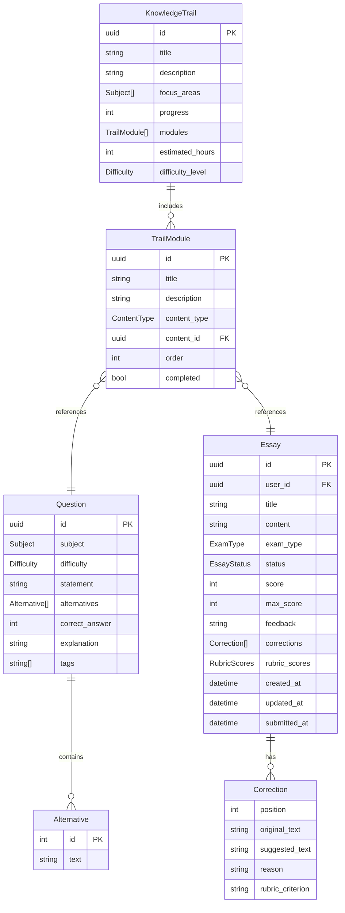
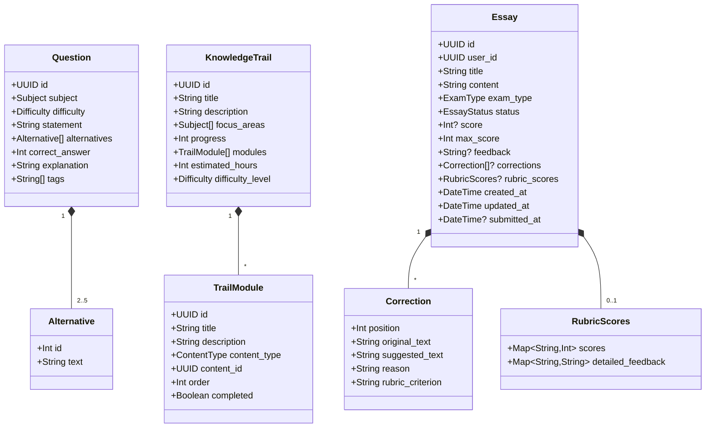
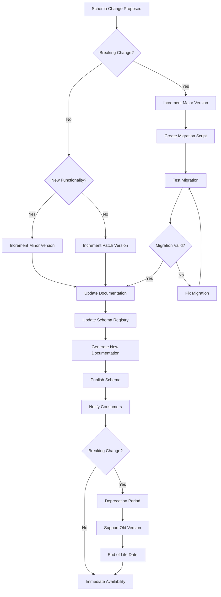
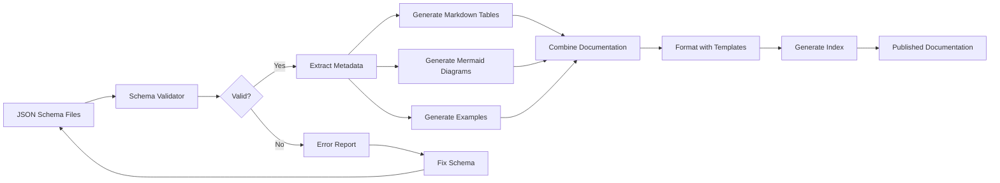

# JSON Schema Visualization Design

## Overview

This design establishes a standardized approach to document and visualize JSON schemas for the NeuroNexus platform using JSON Schema Draft 2020-12 specification combined with industry-standard visualization formats. The goal is to provide clear, maintainable, and human-readable documentation of all data structures used in import/export operations, API contracts, and data persistence.

## Design Goals

- Provide formal JSON Schema definitions for all data models
- Enable automated validation of JSON data against schemas
- Support developer tooling and IDE integration
- Generate visual documentation for non-technical stakeholders
- Facilitate API contract testing and data migration
- Ensure consistency across data import/export operations

## Core Principles

- **Standard Compliance**: Follow JSON Schema Draft 2020-12 specification
- **Self-Documenting**: Schemas must include comprehensive descriptions and examples
- **Validation-Ready**: All schemas must be immediately usable for runtime validation
- **Visual Clarity**: Combine formal schemas with visual diagrams for better comprehension
- **Maintainability**: Single source of truth for data structure definitions

## Schema Organization Strategy

### Directory Structure

The schemas will be organized in a dedicated schemas directory with the following structure:

```
schemas/
├── README.md                           # Documentation and usage guide
├── entities/                           # Core domain entity schemas
│   ├── question.schema.json
│   ├── essay.schema.json
│   ├── knowledge_trail.schema.json
│   └── user.schema.json
├── enums/                              # Enumeration type schemas
│   ├── subject.schema.json
│   ├── difficulty.schema.json
│   ├── exam_type.schema.json
│   └── content_type.schema.json
├── imports/                            # Import format schemas
│   ├── question_import.schema.json
│   └── trail_import.schema.json
└── meta/                               # Schema metadata and common definitions
    ├── common.schema.json
    └── validation_rules.schema.json
```

### Naming Conventions

| Element | Convention | Example |
|---------|-----------|---------|
| Schema Files | `{entity_name}.schema.json` | `question.schema.json` |
| Schema IDs | `https://neuronexus.app/schemas/{category}/{name}` | `https://neuronexus.app/schemas/entities/question` |
| Definitions | PascalCase | `QuestionEntity`, `AlternativeObject` |
| Properties | snake_case (matching Rust serde) | `correct_answer`, `focus_areas` |

## JSON Schema Specification Approach

### Schema Format Standard

All schemas will conform to JSON Schema Draft 2020-12 with the following structure:

| Component | Purpose | Required |
|-----------|---------|----------|
| `$schema` | Declare JSON Schema version | Yes |
| `$id` | Unique identifier for the schema | Yes |
| `title` | Human-readable schema name | Yes |
| `description` | Detailed explanation of purpose | Yes |
| `type` | Primary data type | Yes |
| `properties` | Object property definitions | For objects |
| `required` | List of required properties | For objects |
| `examples` | Example valid instances | Recommended |
| `$defs` | Reusable sub-schemas | As needed |

### Example Schema Structure Template

Each schema will follow this template pattern:

```
{
  "$schema": "https://json-schema.org/draft/2020-12/schema",
  "$id": "[unique schema identifier]",
  "title": "[Schema Title]",
  "description": "[Detailed description of what this schema represents]",
  "type": "[primary type]",
  "properties": { ... },
  "required": [ ... ],
  "examples": [ ... ],
  "$defs": { ... }
}
```

## Schema Definitions for Core Entities

### Question Schema

The Question schema represents multiple-choice questions with the following structure:

| Field | Type | Constraints | Description |
|-------|------|-------------|-------------|
| id | string | format: uuid, required | Unique question identifier |
| subject | string | enum: Subject values, required | Academic subject classification |
| difficulty | string | enum: Facil/Medio/Dificil, required | Question difficulty level |
| statement | string | minLength: 10, required | Question text |
| alternatives | array | minItems: 2, maxItems: 5, required | Answer options |
| correct_answer | integer | minimum: 0, required | Index of correct alternative |
| explanation | string | minLength: 10, required | Answer explanation |
| tags | array | items: string, required | Categorization tags |

### Essay Schema

The Essay schema captures student essays and evaluation data:

| Field | Type | Constraints | Description |
|-------|------|-------------|-------------|
| id | string | format: uuid, required | Unique essay identifier |
| user_id | string | format: uuid, required | Author identifier |
| title | string | minLength: 3, maxLength: 200, required | Essay title |
| content | string | minLength: 100, required | Essay text content |
| exam_type | string | enum: ExamType values, required | Target exam type |
| status | string | enum: EmProgresso/Corrigida/Enviada, required | Current status |
| score | integer | minimum: 0, optional | Awarded score |
| max_score | integer | minimum: 0, required | Maximum possible score |
| feedback | string | optional | Evaluator feedback |
| corrections | array | optional | Detailed corrections |
| rubric_scores | object | optional | Rubric-based scoring |
| created_at | string | format: date-time, required | Creation timestamp |
| updated_at | string | format: date-time, required | Last update timestamp |
| submitted_at | string | format: date-time, optional | Submission timestamp |

### Knowledge Trail Schema

The Knowledge Trail schema defines learning paths:

| Field | Type | Constraints | Description |
|-------|------|-------------|-------------|
| id | string | format: uuid, required | Unique trail identifier |
| title | string | minLength: 3, maxLength: 150, required | Trail title |
| description | string | minLength: 10, required | Trail description |
| focus_areas | array | items: Subject enum, minItems: 1, required | Subject coverage |
| progress | integer | minimum: 0, maximum: 100, required | Completion percentage |
| modules | array | items: TrailModule, required | Learning modules |
| estimated_hours | integer | minimum: 0, required | Time estimate |
| difficulty_level | string | enum: Difficulty values, required | Overall difficulty |

## Enumeration Schemas

### Subject Enumeration

Represents academic subjects:

| Value | Display Name |
|-------|--------------|
| LINGUA_PORTUGUESA | Língua Portuguesa |
| LITERATURA | Literatura |
| INGLES | Inglês |
| ESPANHOL | Espanhol |
| ARTES | Artes |
| EDUCACAO_FISICA | Educação Física |
| TIC | TIC |
| HISTORIA | História |
| GEOGRAFIA | Geografia |
| FILOSOFIA | Filosofia |
| SOCIOLOGIA | Sociologia |
| FISICA | Física |
| QUIMICA | Química |
| BIOLOGIA | Biologia |
| MATEMATICA | Matemática |
| REDACAO | Redação |

### Difficulty Enumeration

Represents difficulty levels:

| Value | Display Name |
|-------|--------------|
| Facil | Fácil |
| Medio | Médio |
| Dificil | Difícil |

### Content Type Enumeration

Represents module content types:

| Value | Description |
|-------|-------------|
| Question | Multiple-choice question |
| Essay | Writing assignment |
| Video | Video content |
| Reading | Reading material |
| PracticeTest | Practice exam |

## Visualization Approach

### Multi-Format Documentation Strategy

The visualization will use multiple complementary formats:

| Format | Purpose | Target Audience |
|--------|---------|-----------------|
| JSON Schema | Formal validation and tooling | Developers |
| Mermaid Class Diagrams | Structure visualization | Developers, Architects |
| Entity Relationship Diagrams | Data relationships | All stakeholders |
| Table Specifications | Quick reference | All stakeholders |
| Examples | Concrete instances | All stakeholders |

### Entity Relationship Visualization



### Class Structure Visualization



## Schema Documentation Format

### Individual Schema Documentation

Each schema file will include:

1. **Schema Metadata Section**
   - Schema version and identifier
   - Title and description
   - Authorship and maintenance information

2. **Type Definitions Section**
   - Primary type declaration
   - Property specifications
   - Required fields list
   - Additional constraints

3. **Validation Rules Section**
   - Pattern validations
   - Range constraints
   - Cross-field validations
   - Custom validation logic

4. **Examples Section**
   - Valid examples demonstrating typical usage
   - Edge cases and boundary conditions
   - Invalid examples showing common mistakes

5. **Referenced Schemas Section**
   - Links to dependent schemas
   - Embedded type definitions

### Common Definitions Schema

A shared schema will define reusable components:

| Definition | Type | Purpose |
|------------|------|---------|
| UUID | string | Standard UUID format validation |
| DateTime | string | ISO 8601 datetime format |
| PositiveInteger | integer | Non-negative integer values |
| NonEmptyString | string | String with minimum length 1 |
| Email | string | Email address format |
| PercentageScore | integer | 0-100 range integer |

## Validation Strategy

### Validation Levels

The schema validation will operate at multiple levels:

| Level | Timing | Scope | Error Handling |
|-------|--------|-------|----------------|
| Structural | Pre-processing | Type and format validation | Reject with detailed error |
| Business Rules | Processing | Domain constraint validation | Reject with business reason |
| Cross-Reference | Post-processing | Referential integrity | Warning or rejection |
| Semantic | User interaction | Logical consistency | User feedback |

### Validation Integration Points

Validation will be integrated at:

1. **Import Operations**
   - Validate JSON files before import
   - Provide detailed error reporting
   - Support partial validation for debugging

2. **API Endpoints**
   - Request payload validation
   - Response schema compliance
   - Contract testing support

3. **Data Persistence**
   - Pre-save validation
   - Migration validation
   - Consistency checks

4. **Development Tools**
   - IDE integration for autocomplete
   - Real-time validation feedback
   - Schema-driven code generation

## Tooling and Generation Strategy

### Schema Documentation Generation

Automated documentation will be generated using:

| Tool | Purpose | Output Format |
|------|---------|---------------|
| JSON Schema Validator | Schema validation | Validation reports |
| Schema Store Integration | Public schema registry | Online documentation |
| Markdown Generator | Human-readable docs | Markdown files |
| OpenAPI Integration | API documentation | OpenAPI 3.1 specs |

### Visual Diagram Generation

Diagrams will be generated from schemas:

1. **Entity Relationship Diagrams**
   - Generated from schema relationships
   - Mermaid ER diagram format
   - Automatic update on schema changes

2. **Class Diagrams**
   - Generated from type definitions
   - Mermaid class diagram format
   - Property and constraint visualization

3. **Data Flow Diagrams**
   - Import/export process flows
   - Transformation pipelines
   - Validation checkpoints

## Schema Versioning Strategy

### Version Management

Schemas will follow semantic versioning:

| Version Component | Trigger | Impact |
|------------------|---------|--------|
| Major (X.0.0) | Breaking changes | Requires migration |
| Minor (0.X.0) | New optional fields | Backward compatible |
| Patch (0.0.X) | Documentation/fixes | No impact |

### Compatibility Rules

| Change Type | Breaking | Version Impact | Migration Required |
|-------------|----------|----------------|-------------------|
| Add optional field | No | Minor | No |
| Add required field | Yes | Major | Yes |
| Remove field | Yes | Major | Yes |
| Change field type | Yes | Major | Yes |
| Rename field | Yes | Major | Yes |
| Add enum value | No | Minor | No |
| Remove enum value | Yes | Major | Yes |
| Tighten constraint | Yes | Major | Yes |
| Relax constraint | No | Minor | No |

### Schema Evolution Process

The evolution of schemas will follow this workflow:



## Import Schema Specifications

### Question Import Schema

The import format for questions will support batch operations:

| Field | Required | Default | Validation |
|-------|----------|---------|------------|
| id | Optional | Generated UUID | Must be valid UUID if provided |
| subject | Required | None | Must match Subject enum |
| difficulty | Required | None | Must match Difficulty enum |
| statement | Required | None | Minimum 10 characters |
| alternatives | Required | None | Array of 2-5 alternatives |
| correct_answer | Required | None | Valid index into alternatives |
| explanation | Required | None | Minimum 10 characters |
| tags | Required | Empty array | Array of strings |

### Trail Import Schema

The import format for knowledge trails will support complex structures:

| Field | Required | Default | Validation |
|-------|----------|---------|------------|
| id | Optional | Generated UUID | Must be valid UUID if provided |
| title | Required | None | 3-150 characters |
| description | Required | None | Minimum 10 characters |
| focus_areas | Required | None | Non-empty Subject array |
| progress | Optional | 0 | 0-100 integer |
| modules | Required | None | Non-empty module array |
| estimated_hours | Required | None | Positive integer |
| difficulty_level | Required | None | Must match Difficulty enum |

## Example Schema Instance

### Question Example

A complete valid question instance:

```
{
  "id": "00000000-0000-0000-0000-000000000001",
  "subject": "MATEMATICA",
  "difficulty": "Medio",
  "statement": "Qual é o valor de x na equação 2x + 5 = 15?",
  "alternatives": [
    {"id": 0, "text": "x = 3"},
    {"id": 1, "text": "x = 5"},
    {"id": 2, "text": "x = 7"},
    {"id": 3, "text": "x = 10"}
  ],
  "correct_answer": 1,
  "explanation": "Para resolver: 2x + 5 = 15 → 2x = 10 → x = 5",
  "tags": ["algebra", "equacoes", "primeiro-grau"]
}
```

### Knowledge Trail Example

A complete valid trail instance:

```
{
  "id": "00000000-0000-0000-0000-000000000101",
  "title": "ENEM - Matemática Completa",
  "description": "Trilha completa de Matemática para o ENEM",
  "focus_areas": ["MATEMATICA"],
  "progress": 0,
  "estimated_hours": 80,
  "difficulty_level": "Medio",
  "modules": [
    {
      "id": "00000000-0000-0000-0000-000000000201",
      "title": "Fundamentos da Matemática",
      "description": "Revisão de conceitos fundamentais",
      "content_type": "Reading",
      "content_id": "00000000-0000-0000-0000-000000000301",
      "order": 0,
      "completed": false
    }
  ]
}
```

## Documentation Generation Workflow

### Automated Documentation Pipeline

The documentation generation will follow this process:



### Documentation Outputs

| Output | Format | Audience | Update Frequency |
|--------|--------|----------|------------------|
| API Reference | OpenAPI 3.1 | Developers | On schema change |
| Developer Guide | Markdown | Developers | On schema change |
| Data Dictionary | HTML/PDF | All stakeholders | Weekly |
| Visual Diagrams | SVG/PNG | Architects | On schema change |
| Example Library | JSON files | Developers | On schema change |

## Error Reporting Standards

### Validation Error Format

Validation errors will follow a structured format:

| Field | Type | Description |
|-------|------|-------------|
| error_code | string | Machine-readable error identifier |
| message | string | Human-readable error description |
| path | string | JSON path to the error location |
| expected | any | Expected value or type |
| actual | any | Actual value received |
| suggestion | string | Recommended fix |

### Error Categories

| Category | Prefix | Description | Example |
|----------|--------|-------------|---------|
| Type Mismatch | TYPE | Wrong data type | Expected string, got integer |
| Missing Required | REQUIRED | Required field absent | Field 'subject' is required |
| Constraint Violation | CONSTRAINT | Value outside allowed range | Score must be 0-100 |
| Format Error | FORMAT | Invalid format | Invalid UUID format |
| Enum Violation | ENUM | Value not in enum | Subject must be one of [...] |
| Reference Error | REFERENCE | Invalid reference | Content ID does not exist |

## Integration with Development Workflow

### IDE Integration

Schema integration will support:

1. **Autocomplete**
   - Property name suggestions
   - Enum value completion
   - Type hints

2. **Inline Validation**
   - Real-time error highlighting
   - Type checking
   - Constraint validation

3. **Documentation Tooltips**
   - Property descriptions
   - Constraint information
   - Example values

### Testing Integration

Schema-based testing will include:

1. **Contract Testing**
   - API request/response validation
   - Data import validation
   - Migration testing

2. **Property-Based Testing**
   - Generate test data from schemas
   - Boundary condition testing
   - Fuzzing with valid data

3. **Regression Testing**
   - Schema evolution testing
   - Backward compatibility verification
   - Migration validation

## Schema Maintenance Responsibilities

| Responsibility | Owner | Frequency | Deliverable |
|----------------|-------|-----------|-------------|
| Schema Definition | Domain Experts | Per feature | Schema files |
| Schema Validation | Automated Tests | Continuous | Test reports |
| Documentation Generation | CI/CD Pipeline | On commit | Generated docs |
| Version Management | Technical Lead | Per release | Version tags |
| Breaking Change Review | Architecture Team | As needed | Migration plans |
| Schema Registry Updates | DevOps | Per release | Published schemas |

## Success Metrics

| Metric | Target | Measurement Method |
|--------|--------|-------------------|
| Schema Coverage | 100% of entities | Count of entities vs schemas |
| Validation Errors Caught | >95% before runtime | Error logs analysis |
| Documentation Freshness | <24 hours lag | Git commit timestamps |
| Breaking Changes | <5% of releases | Version history analysis |
| Schema Adoption | 100% of import/export | Code coverage analysis |

## Future Enhancements

### Planned Extensions

1. **GraphQL Schema Generation**
   - Automatic GraphQL schema from JSON Schema
   - Type-safe resolvers
   - Introspection support

2. **Protocol Buffers Integration**
   - Generate .proto files from schemas
   - Binary serialization support
   - gRPC service definitions

3. **Schema Registry Service**
   - Centralized schema repository
   - Version management API
   - Schema evolution tracking

4. **Interactive Schema Explorer**
   - Web-based schema browser
   - Live validation testing
   - Example generation

5. **Schema-Driven UI Generation**
   - Form generation from schemas
   - Validation rule inference
   - Custom widget mapping
