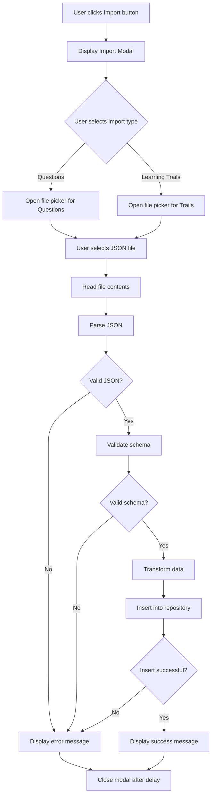

# Profile Import Button Feature Design

## Overview

Add an Import button to the Profile page that allows users to import exam questions and learning trails from properly formatted JSON files into the application's data layer.

## User Interface Design

### Profile Page Layout Enhancement

The Profile page currently displays a two-panel layout with Profile Information on the left and Settings on the right. The Import button will be positioned in the Settings panel header area.

#### Import Button Placement

| Location | Element | Description |
|----------|---------|-------------|
| Settings Panel | Header Area | Position Import button to the right of "CONFIGURAÇÕES" title |
| Visual Style | NeonButton Component | Use existing NeonButton with Secondary variant for consistency |
| Icon | 📥 | Use import icon to indicate file upload functionality |

### Import Modal/Dialog Interface

When the Import button is clicked, display a modal dialog with import options.

#### Modal Structure

| Component | Purpose | Behavior |
|-----------|---------|----------|
| Modal Overlay | Darken background | Click to close modal |
| Modal Container | Center dialog | Contains import options |
| Title | "IMPORTAR DADOS" | Header text in cyberpunk style |
| Import Options | Two buttons | "Import Exam Questions" and "Import Learning Trails" |
| Close Button | Exit modal | X button in top-right corner |

#### Import Options

**Option 1: Import Exam Questions**
- Trigger file picker for JSON file selection
- Validate JSON schema matches Question model structure
- Parse and insert questions into question repository
- Display success/error feedback

**Option 2: Import Learning Trails**
- Trigger file picker for JSON file selection
- Validate JSON schema matches KnowledgeTrail model structure
- Parse and insert trails into knowledge trail repository
- Display success/error feedback

### File Picker Behavior

The file picker component will be implemented using web browser native file input functionality.

| Attribute | Value | Reason |
|-----------|-------|--------|
| Accept | .json | Only allow JSON files |
| Multiple | false | Single file import at a time |
| Display | Hidden | Trigger programmatically via button click |

## Data Schema Validation

### Question Import JSON Schema

The import functionality expects JSON files containing an array of Question objects matching the domain model structure.

#### Expected Structure

```
Root Level: Array of Question objects

Question Object Fields:
- id: UUID string (optional - will generate if missing)
- subject: Subject enum value (SCREAMING_SNAKE_CASE)
- difficulty: Difficulty enum value (Facil, Medio, Dificil)
- statement: String (question text)
- alternatives: Array of Alternative objects
- correct_answer: Number (index of correct alternative)
- explanation: String (explanation text)
- tags: Array of strings

Alternative Object Fields:
- id: Number (alternative index)
- text: String (alternative text)
```

#### Subject Enum Values

Valid values: LINGUA_PORTUGUESA, LITERATURA, INGLES, ESPANHOL, ARTES, EDUCACAO_FISICA, TIC, HISTORIA, GEOGRAFIA, FILOSOFIA, SOCIOLOGIA, FISICA, QUIMICA, BIOLOGIA, MATEMATICA, REDACAO

#### Difficulty Enum Values

Valid values: Facil, Medio, Dificil

### Learning Trail Import JSON Schema

The import functionality expects JSON files containing an array of KnowledgeTrail objects.

#### Expected Structure

```
Root Level: Array of KnowledgeTrail objects

KnowledgeTrail Object Fields:
- id: UUID string (optional - will generate if missing)
- title: String (trail title)
- description: String (trail description)
- focus_areas: Array of Subject enum values
- progress: Number (0-100, defaults to 0)
- modules: Array of TrailModule objects
- estimated_hours: Number (estimated completion time)
- difficulty_level: Difficulty enum value

TrailModule Object Fields:
- id: UUID string (optional - will generate if missing)
- title: String (module title)
- description: String (module description)
- content_type: ContentType enum value
- content_id: UUID string (reference to content)
- order: Number (module sequence)
- completed: Boolean (defaults to false)
```

#### ContentType Enum Values

Valid values: Question, Essay, Video, Reading, PracticeTest

## Component Architecture

### Frontend Components

#### New Components Required

| Component Name | Purpose | Location |
|----------------|---------|----------|
| ImportModal | Display import options modal | app/src/components/import_modal.rs |
| FileInputHandler | Handle file selection and reading | Integrated into ImportModal |
| ImportFeedback | Display success/error messages | Reusable notification component |

#### Existing Components to Modify

| Component | Changes Required |
|-----------|-----------------|
| Profile | Add Import button to Settings panel header |
| NeonButton | No changes - reuse existing component |

### State Management

The import feature requires managing the following state:

| State Variable | Type | Purpose |
|----------------|------|---------|
| show_import_modal | Signal<bool> | Controls modal visibility |
| import_type | Signal<Option<ImportType>> | Tracks selected import type |
| import_status | Signal<ImportStatus> | Tracks import operation status |
| import_message | Signal<String> | Feedback message for user |

#### ImportType Enum

Values: Questions, LearningTrails

#### ImportStatus Enum

Values: Idle, Processing, Success, Error

## Backend Processing Flow

### Import Processing Workflow



### File Reading Strategy

The file reading implementation differs based on the target platform:

| Platform | Implementation | API |
|----------|---------------|-----|
| Web | FileReader API | web-sys crate with wasm-bindgen |
| Desktop | Native file dialog | rfd crate or native file picker |

### Data Validation Rules

#### Question Validation

| Field | Validation Rule | Error Message |
|-------|----------------|---------------|
| subject | Must be valid Subject enum | "Invalid subject value" |
| difficulty | Must be valid Difficulty enum | "Invalid difficulty value" |
| statement | Non-empty string | "Question statement cannot be empty" |
| alternatives | Array length between 2-5 | "Must have 2-5 alternatives" |
| correct_answer | Valid index within alternatives array | "Invalid correct answer index" |
| explanation | Non-empty string | "Explanation cannot be empty" |
| tags | Array (can be empty) | N/A |

#### Learning Trail Validation

| Field | Validation Rule | Error Message |
|-------|----------------|---------------|
| title | Non-empty string | "Trail title cannot be empty" |
| description | Non-empty string | "Trail description cannot be empty" |
| focus_areas | Non-empty array of valid Subject enums | "Must have at least one focus area" |
| progress | Number between 0-100 | "Progress must be 0-100" |
| modules | Non-empty array | "Trail must have at least one module" |
| estimated_hours | Positive number | "Estimated hours must be positive" |
| difficulty_level | Valid Difficulty enum | "Invalid difficulty level" |

### Repository Integration

The import functionality interacts with existing repository methods.

#### Question Import Integration

| Repository | Method | Purpose |
|------------|--------|---------|
| InMemoryQuestionRepository | insert | Add new question to storage |

Process:
1. Deserialize JSON into Vec<Question>
2. For each question, generate UUID if missing
3. Call repository insert method
4. Track success/failure count
5. Return result summary

#### Learning Trail Import Integration

| Repository | Method | Purpose |
|------------|--------|---------|
| InMemoryKnowledgeTrailRepository | insert | Add new trail to storage |

Process:
1. Deserialize JSON into Vec<KnowledgeTrail>
2. For each trail, generate UUIDs if missing (trail and modules)
3. Validate module content_id references exist
4. Call repository insert method
5. Track success/failure count
6. Return result summary

## User Feedback

### Feedback Messages

| Scenario | Message | Display Duration |
|----------|---------|-----------------|
| Import started | "Importing data..." | While processing |
| Questions success | "Successfully imported X questions" | 3 seconds |
| Trails success | "Successfully imported X learning trails" | 3 seconds |
| Invalid JSON | "Invalid JSON file format" | 5 seconds |
| Schema validation error | "File does not match expected schema: [details]" | 5 seconds |
| Partial success | "Imported X of Y items. Z errors encountered." | 5 seconds |
| File read error | "Failed to read file" | 5 seconds |

### Visual Feedback Elements

| Element | State | Visual Indicator |
|---------|-------|-----------------|
| Import Modal | Processing | Loading spinner with neon glow animation |
| Import Modal | Success | Green neon checkmark icon |
| Import Modal | Error | Red neon X icon |
| Import Button | Disabled during import | Opacity reduced, no hover effects |

## Edge Cases and Error Handling

### Edge Case Scenarios

| Scenario | Handling Strategy |
|----------|------------------|
| Large file (>10MB) | Warn user and confirm before processing |
| Duplicate IDs | Generate new UUID and log warning |
| Missing optional fields | Use default values per domain model |
| Malformed JSON | Parse error caught and displayed to user |
| Empty file | Display "No data found in file" |
| Non-JSON file selected | Validate file extension before processing |
| Network failure (web) | Retry mechanism or clear error message |

### Error Recovery

All import operations should be atomic - either all items succeed or the operation is rolled back.

| Error Type | Recovery Action |
|------------|----------------|
| Parse error | Stop processing, display error location if available |
| Validation error | Stop processing, display first validation failure |
| Repository error | Rollback inserted items, display error message |
| File access error | Display clear permission/access error |

## Accessibility Considerations

| Requirement | Implementation |
|-------------|----------------|
| Keyboard navigation | Modal closable via ESC key, buttons focusable |
| Screen reader support | Proper ARIA labels for file input and modal |
| Error announcements | Errors announced to screen readers |
| Focus management | Focus returns to Import button after modal close |

## Performance Considerations

### Optimization Strategies

| Aspect | Strategy | Rationale |
|--------|----------|-----------|
| File size limit | 10MB maximum | Prevent browser/app freeze |
| Batch processing | Process in chunks of 100 items | Maintain UI responsiveness |
| Async operations | All file I/O and parsing async | Non-blocking UI |
| Validation performance | Early exit on first error | Faster feedback |

### Expected Performance

| Operation | Expected Duration | Max Acceptable Duration |
|-----------|------------------|------------------------|
| File selection | Instant | 100ms |
| File read (1MB) | <200ms | 500ms |
| JSON parse (1000 items) | <500ms | 2 seconds |
| Validation (1000 items) | <300ms | 1 second |
| Repository insert (1000 items) | <1 second | 3 seconds |

## Future Enhancements

Potential improvements for future iterations:

1. **Bulk Export**: Add export functionality to download Questions or Learning Trails as JSON
2. **Import History**: Track previous imports with timestamps and item counts
3. **Data Preview**: Show preview of data before confirming import
4. **Merge Options**: Allow merging imported data with existing data instead of just adding
5. **Import from URL**: Support importing from remote JSON URLs
6. **Drag and Drop**: Support drag-and-drop file import
7. **Format Validation Tool**: Standalone tool to validate JSON before import
8. **Progress Bar**: Show detailed progress during large imports
9. **Undo Import**: Allow reverting recently imported data

## Dependencies

### Existing Dependencies

All required dependencies are already in the project workspace:

| Dependency | Usage |
|------------|-------|
| serde_json | JSON parsing and serialization |
| uuid | UUID generation for missing IDs |
| dioxus | UI components and state management |
| web-sys | File API access (web platform) |
| wasm-bindgen | JavaScript interop (web platform) |

### No New Dependencies Required

The feature can be implemented entirely with existing project dependencies.

## Testing Considerations

### Test Scenarios

| Test Case | Expected Outcome |
|-----------|-----------------|
| Valid questions JSON import | All questions successfully imported |
| Valid trails JSON import | All trails successfully imported |
| Invalid JSON syntax | Error message displayed |
| Invalid subject enum | Validation error displayed |
| Missing required field | Validation error displayed |
| Empty file | "No data found" message |
| File with mixed valid/invalid items | Partial success message with error count |
| Large file (5000+ items) | Import completes without freezing UI |
| Duplicate question IDs | New UUIDs generated, all imported |
| Cancel during import | Import stopped, partial data not saved |

### Sample Test Data

Test JSON files should be created for both questions and learning trails covering:
- Minimum valid structure
- Full featured structure with all optional fields
- Invalid structures for error handling tests
- Large datasets for performance testing
- Edge cases (empty arrays, null values, etc.)

## Security Considerations

| Risk | Mitigation |
|------|-----------|
| Malicious JSON injection | Strict schema validation before processing |
| XSS via imported content | Sanitize all string fields during display |
| Large file DoS | File size limit enforcement |
| Invalid references | Validate content_id references exist before import |
| File type spoofing | Validate actual JSON content, not just extension |

## Implementation Priority

| Component | Priority | Rationale |
|-----------|----------|-----------|
| Import Modal UI | High | Required for user interaction |
| File picker integration | High | Core functionality |
| JSON parsing logic | High | Core functionality |
| Questions import | High | Most commonly needed feature |
| Learning Trails import | Medium | Less frequently used initially |
| Error handling | High | Critical for user experience |
| Feedback UI | Medium | Enhances user experience |
| Validation details | Low | Can start with basic validation |

## Success Metrics

The feature is successful when:

1. Users can successfully import valid JSON files for both Questions and Learning Trails
2. Invalid files are rejected with clear error messages
3. Import operations complete within acceptable time limits
4. The UI remains responsive during import operations
5. Imported data is correctly stored in repositories and visible in the app
6. No data corruption occurs from import operations
7. Users receive clear feedback on import success or failure6. No data corruption occurs from import operations
