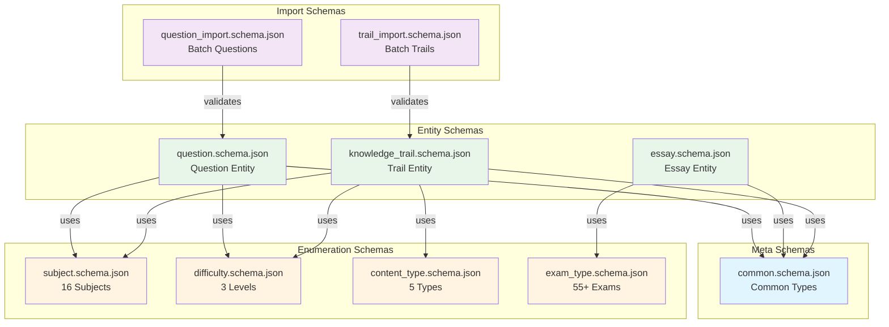
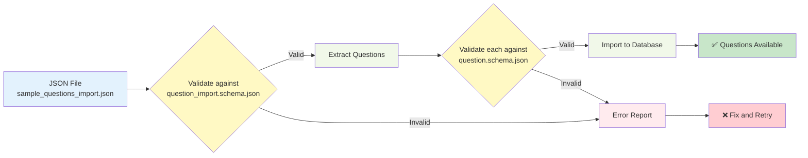
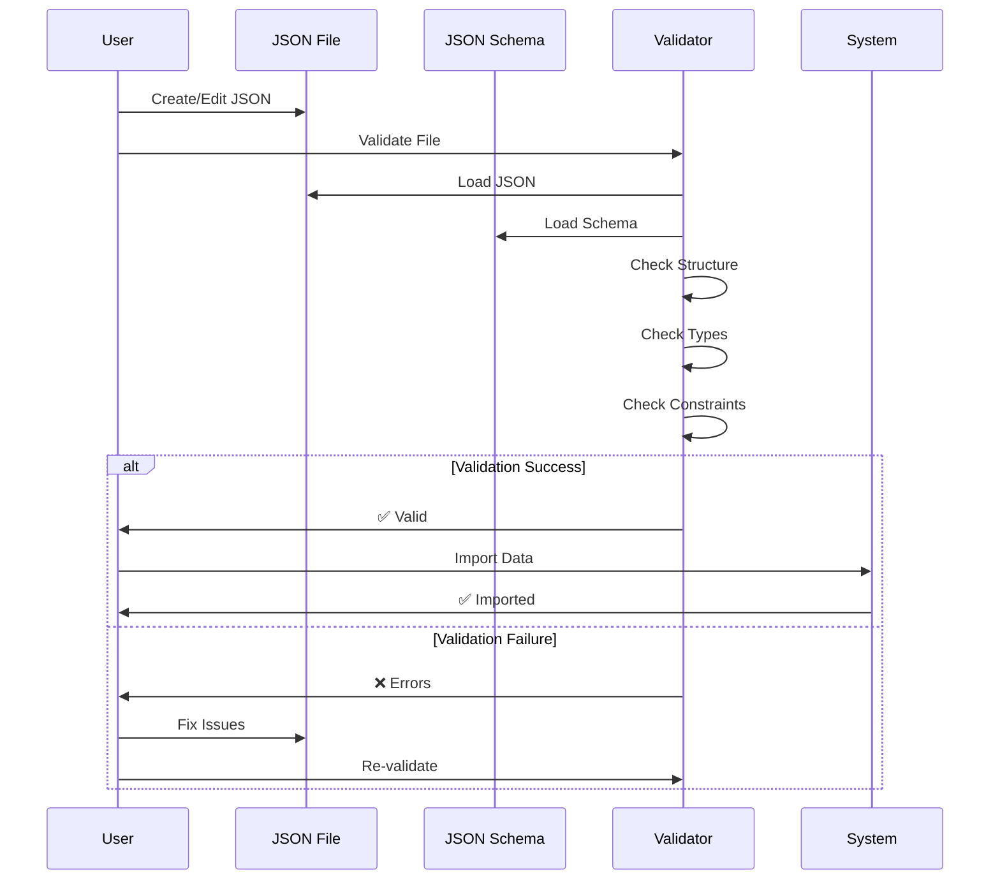
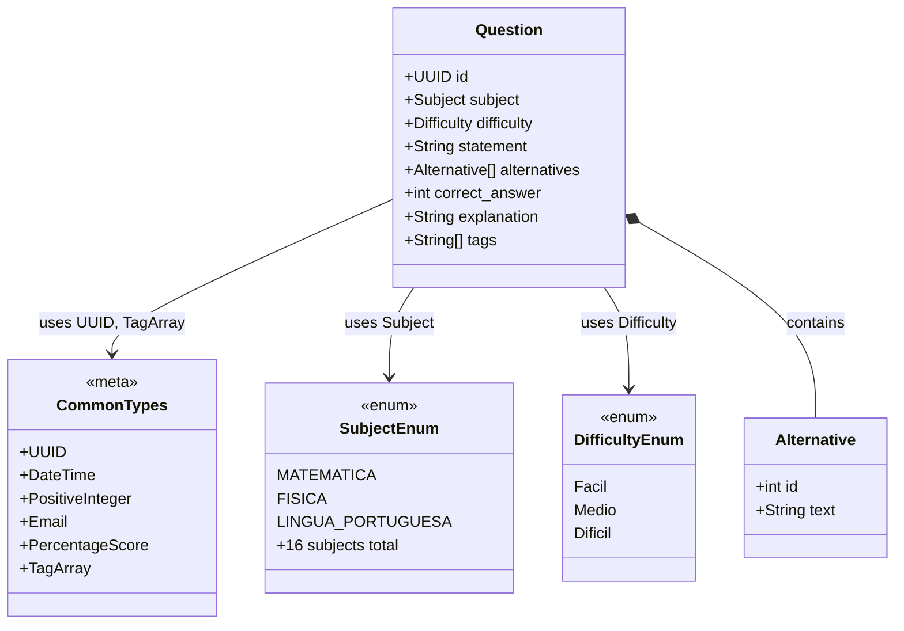
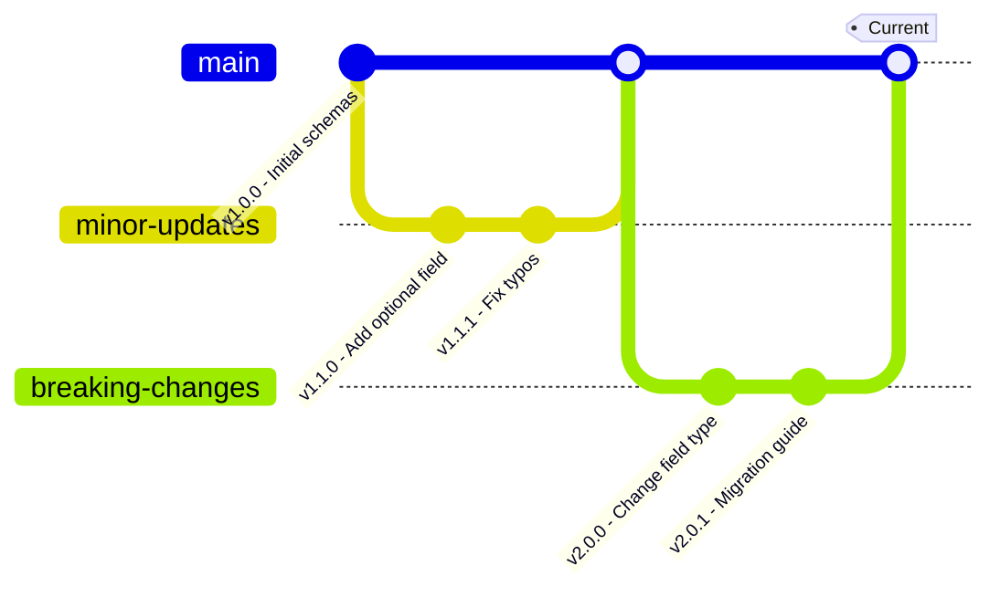
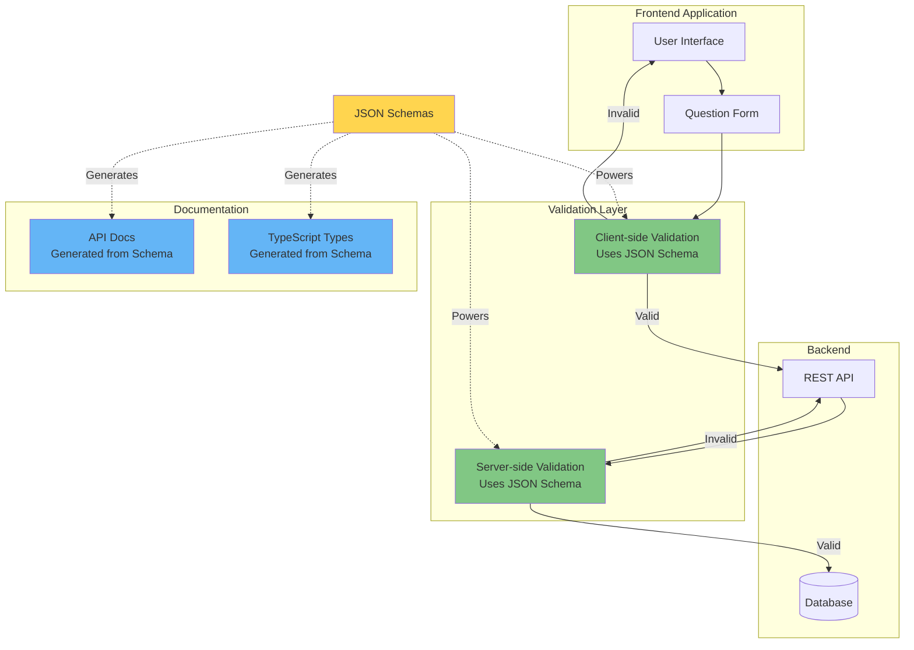

# JSON Schema Visualization Examples

This document provides visual examples of how the JSON schemas relate to actual data and how they can be used for validation and documentation.

## Schema Relationship Diagram



## Data Flow: Question Import



## Validation Workflow



## Example: Question Schema Validation

### Valid Question

```json
{
  "id": "550e8400-e29b-41d4-a716-446655440000",
  "subject": "MATEMATICA",
  "difficulty": "Medio",
  "statement": "Qual é a soma de 5 + 3?",
  "alternatives": [
    {"id": 0, "text": "6"},
    {"id": 1, "text": "7"},
    {"id": 2, "text": "8"},
    {"id": 3, "text": "9"}
  ],
  "correct_answer": 2,
  "explanation": "A soma de 5 + 3 é igual a 8.",
  "tags": ["aritmetica", "soma"]
}
```

✅ **Validation Result**: PASS
- All required fields present
- UUID format valid
- Subject in enum
- Difficulty in enum
- 4 alternatives (within 2-5 range)
- correct_answer is valid index
- Statement ≥ 10 characters
- Tags are unique

### Invalid Question Examples

#### Missing Required Field

```json
{
  "id": "550e8400-e29b-41d4-a716-446655440000",
  "subject": "MATEMATICA",
  "difficulty": "Medio",
  "statement": "Qual é a soma de 5 + 3?",
  "alternatives": [
    {"id": 0, "text": "8"}
  ],
  "correct_answer": 0,
  "explanation": "A soma é 8."
  // ❌ Missing "tags" field
}
```

❌ **Error**: `Required property 'tags' is missing`

#### Invalid Enum Value

```json
{
  "id": "550e8400-e29b-41d4-a716-446655440000",
  "subject": "PROGRAMMING", // ❌ Invalid subject
  "difficulty": "Medio",
  "statement": "Qual é a soma de 5 + 3?",
  "alternatives": [
    {"id": 0, "text": "8"}
  ],
  "correct_answer": 0,
  "explanation": "A soma é 8.",
  "tags": ["aritmetica"]
}
```

❌ **Error**: `Value 'PROGRAMMING' is not in enum [MATEMATICA, FISICA, ...]`

#### Constraint Violation

```json
{
  "id": "550e8400-e29b-41d4-a716-446655440000",
  "subject": "MATEMATICA",
  "difficulty": "Medio",
  "statement": "Curta", // ❌ Too short (< 10 chars)
  "alternatives": [
    {"id": 0, "text": "8"}
  ],
  "correct_answer": 0,
  "explanation": "A soma é 8.",
  "tags": ["aritmetica"]
}
```

❌ **Error**: `String 'Curta' is too short (minimum: 10 characters)`

## Schema Hierarchy Visualization



## Type Reference Quick Guide

### Common Types Usage

| Type | JSON Schema Ref | Example Value |
|------|----------------|---------------|
| UUID | `{"$ref": "../meta/common.schema.json#/$defs/UUID"}` | `"550e8400-e29b-41d4-a716-446655440000"` |
| DateTime | `{"$ref": "../meta/common.schema.json#/$defs/DateTime"}` | `"2023-12-01T10:30:00Z"` |
| PercentageScore | `{"$ref": "../meta/common.schema.json#/$defs/PercentageScore"}` | `75` |
| TagArray | `{"$ref": "../meta/common.schema.json#/$defs/TagArray"}` | `["algebra", "geometry"]` |

### Enum Types Usage

| Type | JSON Schema Ref | Example Value |
|------|----------------|---------------|
| Subject | `{"$ref": "../enums/subject.schema.json"}` | `"MATEMATICA"` |
| Difficulty | `{"$ref": "../enums/difficulty.schema.json"}` | `"Medio"` |
| ContentType | `{"$ref": "../enums/content_type.schema.json"}` | `"Question"` |
| ExamType | `{"$ref": "../enums/exam_type.schema.json"}` | `"ENEM"` |

## Schema Versioning Example



## Import Format Comparison

### Single Question vs Batch Import

**Single Question (question.schema.json)**:
```json
{
  "id": "...",
  "subject": "MATEMATICA",
  "difficulty": "Medio",
  // ... other fields
}
```

**Batch Import (question_import.schema.json)**:
```json
[
  {
    "id": "...", // Optional
    "subject": "MATEMATICA",
    "difficulty": "Medio",
    // ... other fields
  },
  {
    "subject": "FISICA", // No ID - will be generated
    "difficulty": "Dificil",
    // ... other fields
  }
]
```

## Real-World Integration Example



## Benefits Summary

### For Developers

✅ **IDE Support**
- Autocomplete in JSON files
- Real-time validation
- Inline documentation

✅ **Type Safety**
- Generate TypeScript/Rust types
- Consistent data structures
- Compile-time checks

✅ **Testing**
- Automated validation tests
- Contract testing
- Mock data generation

### For Documentation

✅ **Single Source of Truth**
- Schemas document themselves
- Always up-to-date
- Version controlled

✅ **API Documentation**
- Auto-generate API docs
- Interactive examples
- Clear constraints

### For Data Quality

✅ **Validation**
- Prevent invalid data
- Early error detection
- Clear error messages

✅ **Consistency**
- Uniform data format
- Standard constraints
- Reusable definitions

## Next Steps

1. **Integrate with CI/CD**: Add schema validation to build pipeline
2. **Generate Types**: Create Rust/TypeScript types from schemas
3. **API Documentation**: Generate OpenAPI specs
4. **IDE Configuration**: Set up schema associations
5. **Monitoring**: Track validation errors in production
